# TheRoadTrip
This mod was inspired by the [OGC map](https://www.beamng.com/resources/ogc-map-ultimate-beam-ng-map-0-27-compatible.22814/) made by [Online90](https://www.beamng.com/resources/authors/online90.483354/).

*NOTE*
You probably need a beefy computer to run the map, especially in terms of ram and vram because of the amount of textures and objects to load.
It runs fine for me on a 3060ti (8GB vram), i5 12400 and 16GB of ram.

As pointed out by [ARES IV](https://www.beamng.com/members/ares-iv.347113/), having a lot of virtual memory (more than 45GB total) may help you load the map.
To do that, you may refer to [this guide](https://www.windowscentral.com/how-change-virtual-memory-size-windows-10).

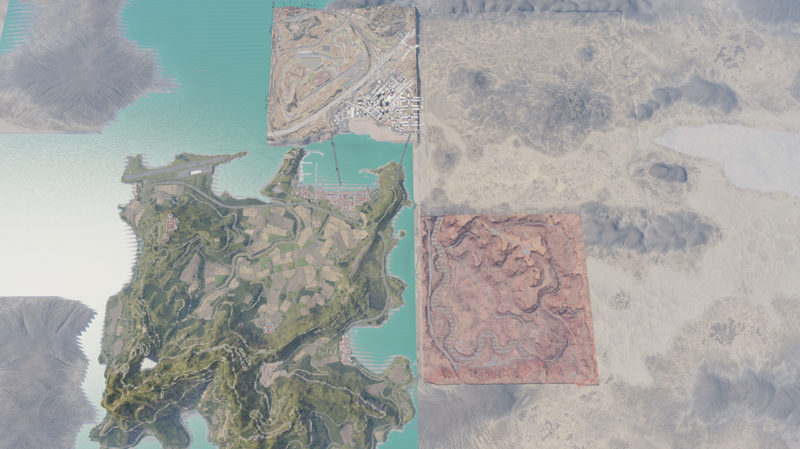 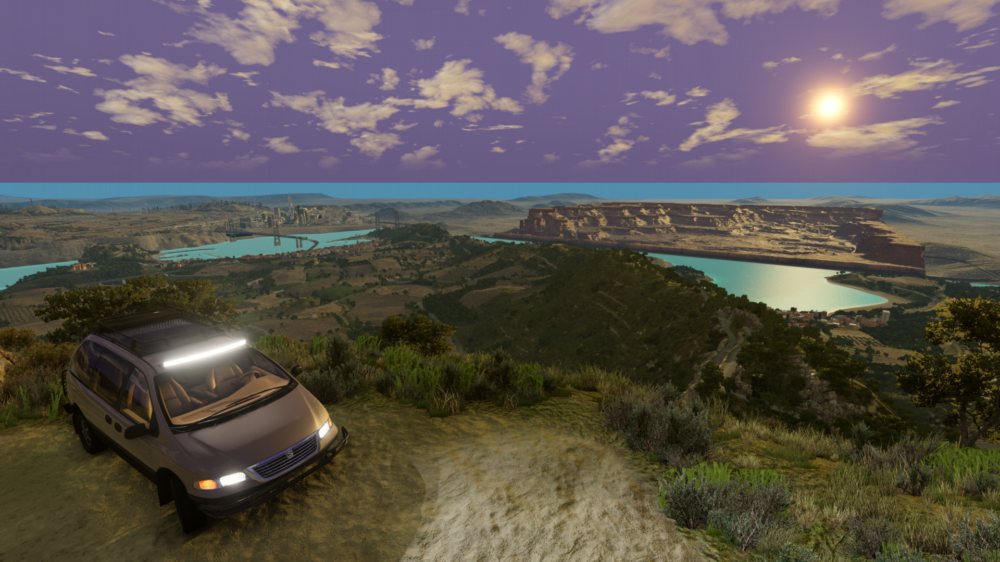 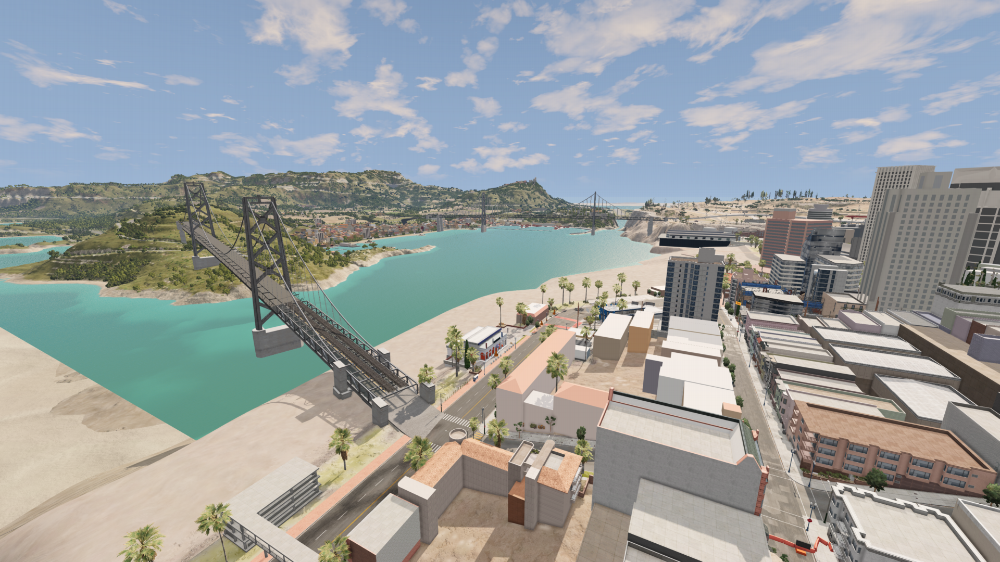 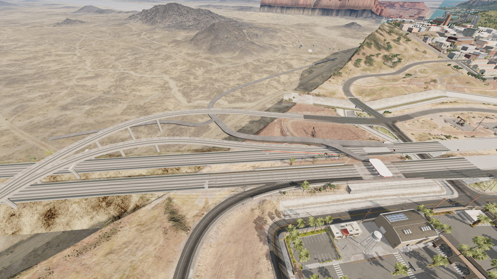 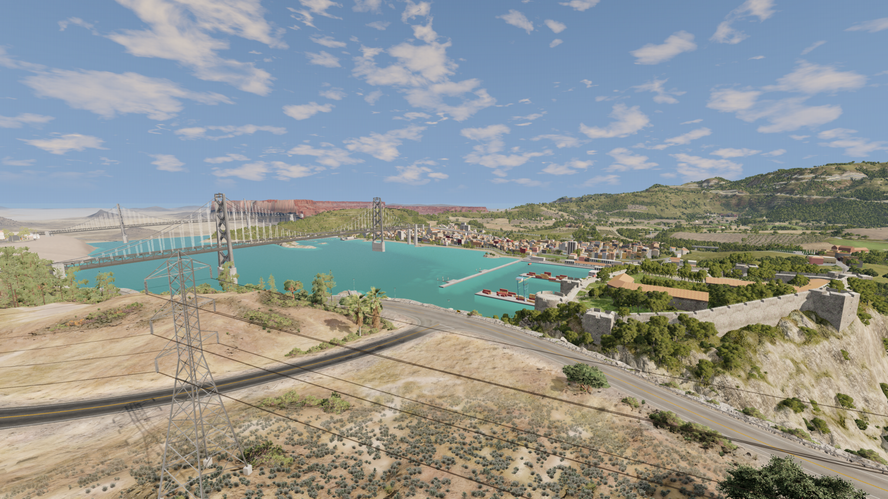 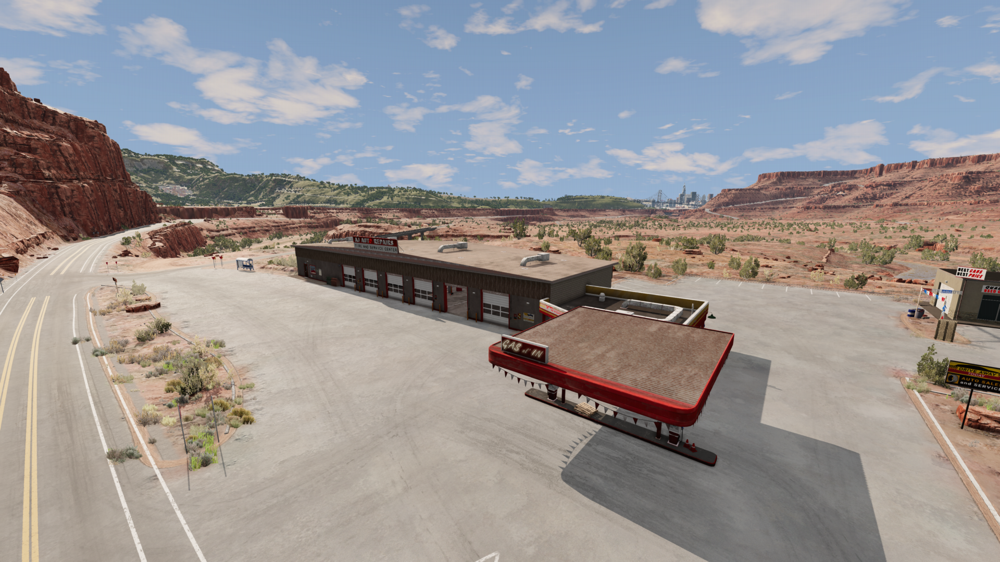 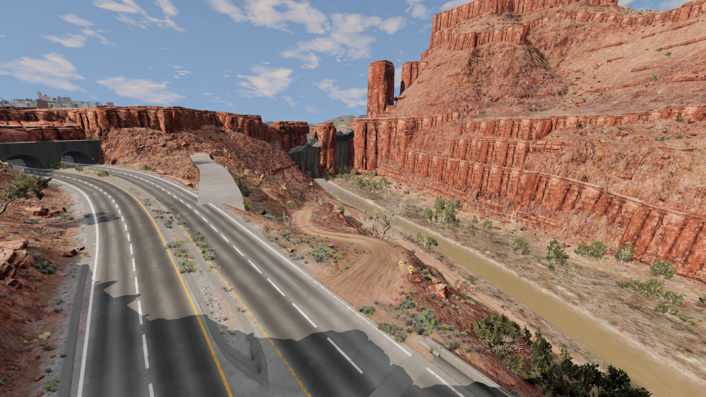 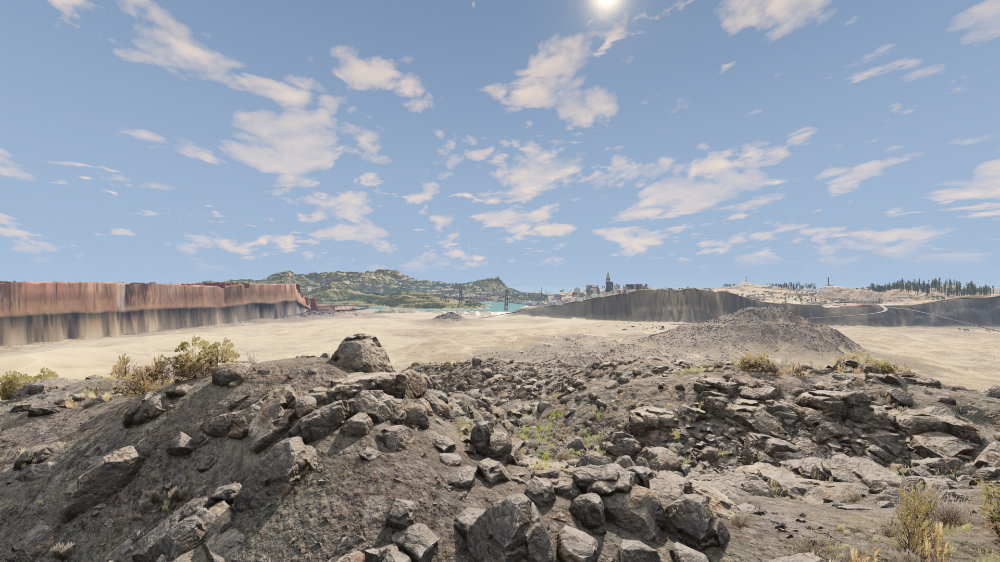 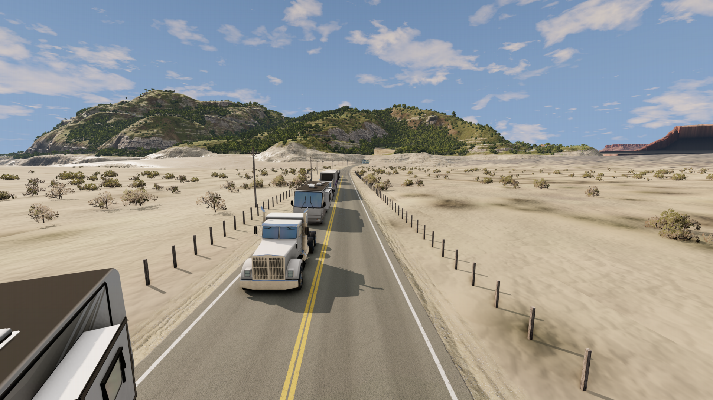 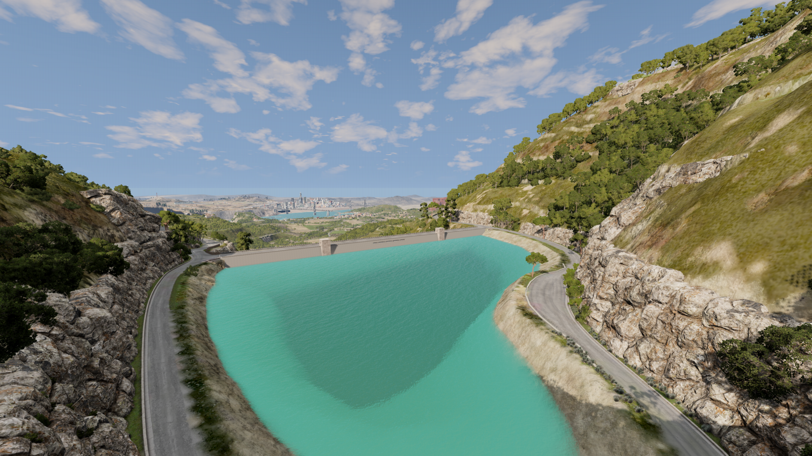

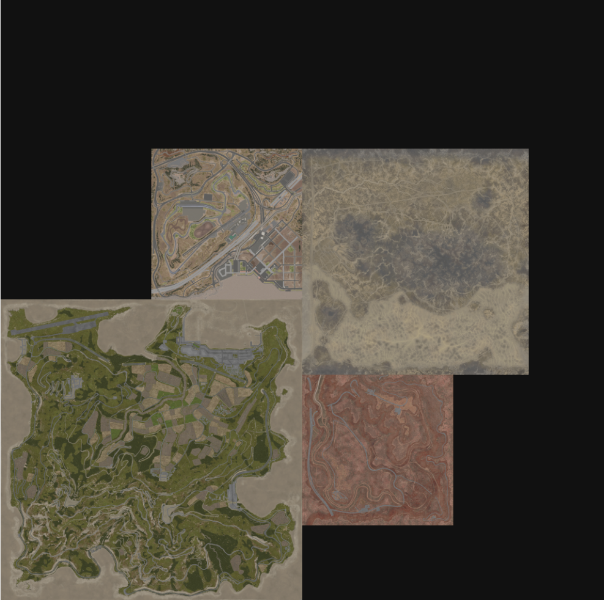
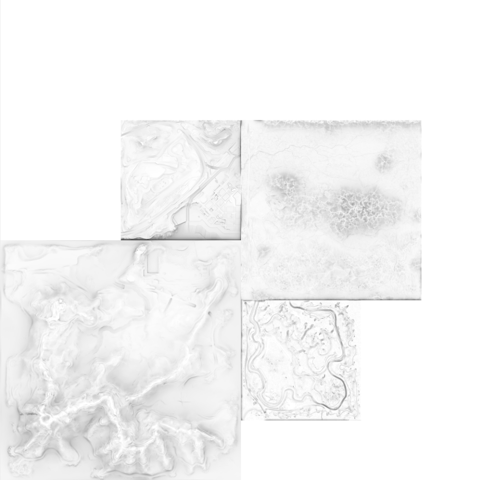
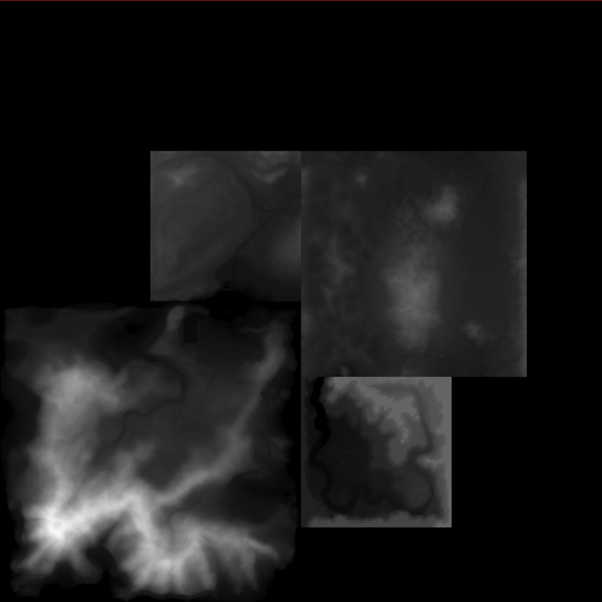

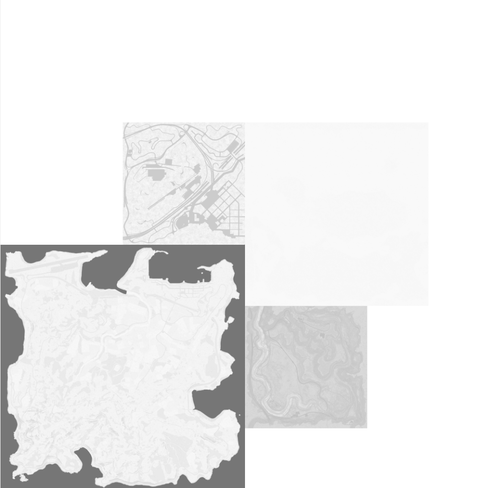
                       